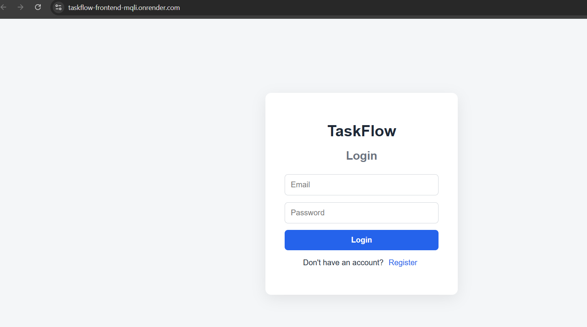
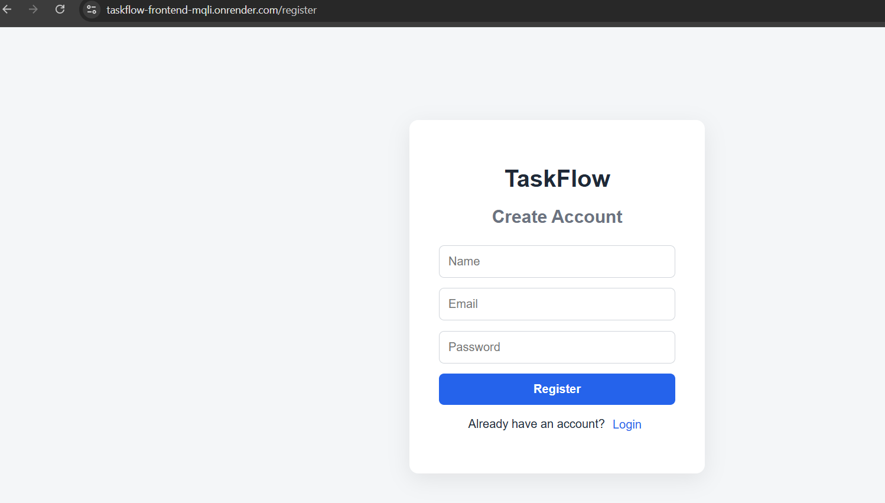
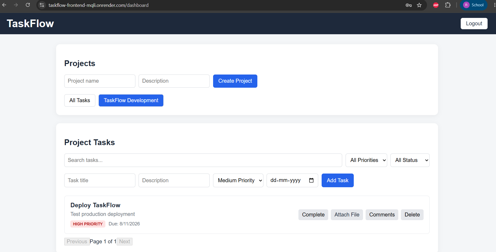
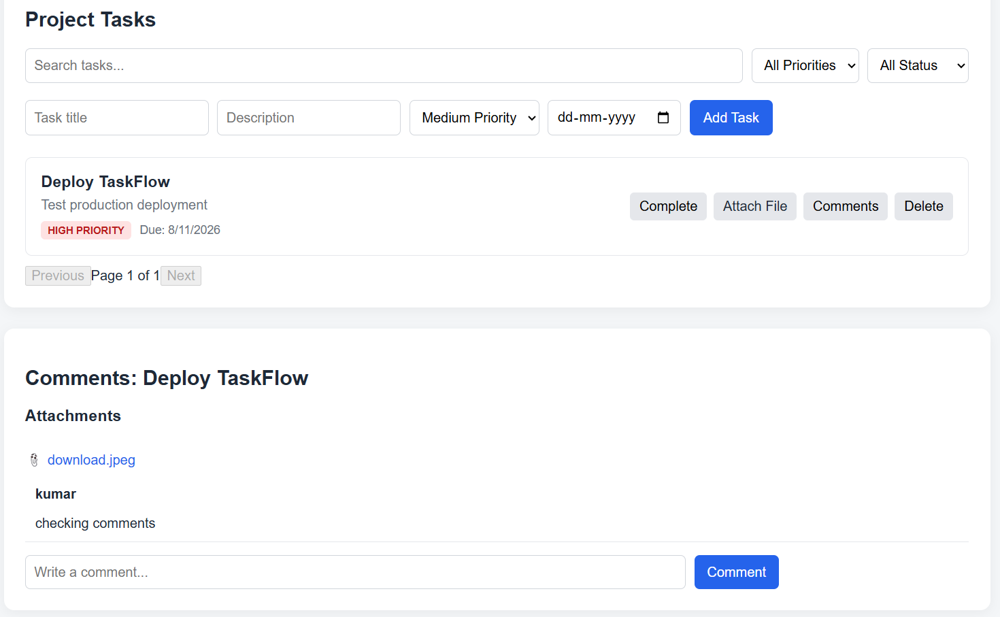
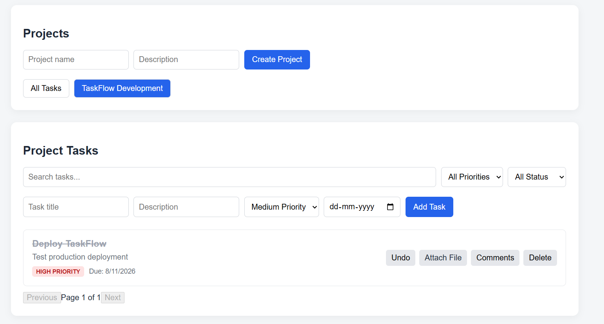

# TaskFlow - Full-Stack Task Management and Collaboration Platform

TaskFlow is a full-stack task management and collaboration platform designed
to provide a practical Trello-like workflow for managing projects and tasks.

It supports authenticated users, project organization, task tracking,
comments, file attachments, search, filtering, pagination, and a RESTful
backend API.

The application is built with React, Node.js, Express.js, and PostgreSQL.
JWT is used for authentication and bcrypt is used for secure password hashing.

## Live Demo

Frontend:
https://taskflow-frontend-mqli.onrender.com

Backend:
https://taskflow-backend-8sc7.onrender.com

## Key Features

- User registration and login
- JWT-based authentication
- Secure password hashing with bcrypt
- Protected backend routes
- User-specific projects and tasks
- Project creation and management
- Task creation with title and description
- Task priority and due dates
- Mark tasks as completed
- Undo task completion
- Search tasks by text
- Filter tasks by priority
- Filter tasks by completion status
- Pagination for task lists
- Comments on tasks
- File attachments on tasks
- PostgreSQL relational database
- RESTful API architecture
- Responsive web interface
- Separate frontend and backend deployment

## Screenshots

Add screenshots of the application in the sections below.

### Login

<!-- Upload your login screenshot to the repository and replace the path below -->

### Register

### Dashboard

### Comments and Attachments

### project status

## Technology Stack

### Frontend

- React
- Vite
- Axios
- JavaScript
- HTML
- CSS

### Backend

- Node.js
- Express.js
- REST APIs
- JWT
- bcrypt
- Multer

### Database

- PostgreSQL

### Deployment and Version Control

- Render
- GitHub

## Project Architecture

The application is separated into frontend and backend services.

    TaskFlow/
    |
    +-- backend/
    |   |
    |   +-- middleware/
    |   |   +-- authMiddleware.js
    |   |
    |   +-- routes/
    |   |   +-- auth.js
    |   |   +-- tasks.js
    |   |   +-- projects.js
    |   |   +-- comments.js
    |   |   +-- attachments.js
    |   |
    |   +-- uploads/
    |   +-- db.js
    |   +-- server.js
    |   +-- package.json
    |
    +-- frontend/
        |
        +-- src/
        |   |
        |   +-- components/
        |   |   +-- Navbar.jsx
        |   |
        |   +-- pages/
        |   |   +-- Dashboard.jsx
        |   |   +-- Login.jsx
        |   |   +-- Register.jsx
        |   |
        |   +-- services/
        |       +-- api.js
        |
        +-- package.json

## System Architecture

    +-------------------+
    |    User Browser   |
    +---------+---------+
              |
              | HTTP / REST API
              v
    +-------------------+
    | React Frontend    |
    | Vite              |
    +---------+---------+
              |
              | Axios
              v
    +-------------------+
    | Node.js + Express |
    | REST API          |
    +---------+---------+
              |
              | SQL
              v
    +-------------------+
    | PostgreSQL        |
    | Relational DB     |
    +-------------------+

The frontend and backend are deployed as separate services on Render.

## Database Design

TaskFlow uses PostgreSQL as its relational database.

Main relationships:

    users
      |
      +-- projects
      |
      +-- tasks
            |
            +-- comments
            |
            +-- attachments

### Users

Stores registered user accounts.

Main fields:

- id
- name
- email
- password
- created_at

Passwords are stored as bcrypt hashes rather than plain text.

### Projects

Stores projects created by users.

Main fields:

- id
- name
- description
- user_id
- created_at

### Tasks

Stores tasks belonging to users and optionally associated with projects.

Main fields:

- id
- title
- description
- completed
- priority
- due_date
- project_id
- user_id

### Comments

Stores comments associated with tasks.

Main fields:

- id
- content
- user_id
- task_id
- created_at

### Attachments

Stores information about files uploaded to tasks.

Main fields:

- id
- filename
- filepath
- task_id
- user_id
- uploaded_at

## Authentication Flow

TaskFlow uses JWT-based authentication.

    1. User registers
           |
           v
    2. Backend validates request
           |
           v
    3. Password is hashed using bcrypt
           |
           v
    4. User is stored in PostgreSQL
           |
           v
    5. User logs in
           |
           v
    6. Backend verifies password
           |
           v
    7. JWT token is generated
           |
           v
    8. Frontend stores token
           |
           v
    9. Token is sent with protected API requests

Protected requests use the Authorization header:

    Authorization: Bearer <JWT_TOKEN>

## API Overview

### Authentication

    POST /auth/register
    POST /auth/login

### Tasks

    GET    /tasks
    POST   /tasks
    PUT    /tasks/:id
    DELETE /tasks/:id

### Projects

    GET    /projects
    POST   /projects
    DELETE /projects/:id

### Comments

    GET  /comments/:taskId
    POST /comments/:taskId

### Attachments

    GET  /attachments/:taskId
    POST /attachments/:taskId

The backend uses parameterized SQL queries when communicating with
PostgreSQL.

## Task Management

Each task can contain:

- Title
- Description
- Priority
- Due date
- Completion status
- Project association
- Comments
- File attachments

Users can create tasks, update their status, search and filter tasks,
mark tasks as completed, and undo completion.

## Search, Filtering, and Pagination

The dashboard provides tools for managing larger task lists.

Users can:

- Search tasks by text
- Filter tasks by priority
- Filter tasks by completion status
- Navigate through multiple pages

This reduces clutter and keeps the task dashboard usable as the number of
tasks grows.

## File Uploads

TaskFlow supports attaching files to individual tasks.

Each attachment is associated with:

- The task
- The user
- The stored filename
- The file path
- The upload timestamp

Multer is used on the backend to process file uploads.

## Security

The project includes several basic security practices:

- Password hashing with bcrypt
- JWT authentication
- Protected backend routes
- User-specific resource access
- Parameterized PostgreSQL queries
- Environment variables for database credentials
- Environment variables for JWT secrets
- .env excluded from Git using .gitignore

Sensitive configuration values are not hard-coded into the source code.

## Environment Variables

Backend configuration uses environment variables.

Example:

    DB_USER=your_database_user
    DB_HOST=your_database_host
    DB_NAME=your_database_name
    DB_PASSWORD=your_database_password
    DB_PORT=5432
    JWT_SECRET=your_jwt_secret

Frontend API configuration:

    VITE_API_URL=your_backend_url

Never commit real credentials or secrets to GitHub.

## Running Locally

### 1. Clone the repository

    git clone https://github.com/Ruthwik-3556/TaskFlow.git
    cd TaskFlow

### 2. Start the backend

    cd backend
    npm install
    node server.js

The backend runs on:

    http://localhost:5000

### 3. Start the frontend

Open another terminal:

    cd frontend
    npm install
    npm run dev

The frontend will be available at the local Vite development URL shown
in the terminal.

## PostgreSQL Setup

Create a PostgreSQL database and configure the backend environment variables.

Create the required tables:

    CREATE TABLE users (
        id SERIAL PRIMARY KEY,
        name VARCHAR(100) NOT NULL,
        email VARCHAR(255) UNIQUE NOT NULL,
        password VARCHAR(255) NOT NULL,
        created_at TIMESTAMP DEFAULT CURRENT_TIMESTAMP
    );

    CREATE TABLE projects (
        id SERIAL PRIMARY KEY,
        name VARCHAR(255) NOT NULL,
        description TEXT,
        user_id INTEGER NOT NULL REFERENCES users(id) ON DELETE CASCADE,
        created_at TIMESTAMP DEFAULT CURRENT_TIMESTAMP
    );

    CREATE TABLE tasks (
        id SERIAL PRIMARY KEY,
        title VARCHAR(255) NOT NULL,
        description TEXT,
        completed BOOLEAN DEFAULT FALSE,
        priority VARCHAR(20) DEFAULT 'medium',
        due_date DATE,
        project_id INTEGER REFERENCES projects(id) ON DELETE SET NULL,
        user_id INTEGER NOT NULL REFERENCES users(id) ON DELETE CASCADE
    );

    CREATE TABLE comments (
        id SERIAL PRIMARY KEY,
        content TEXT NOT NULL,
        user_id INTEGER NOT NULL REFERENCES users(id) ON DELETE CASCADE,
        task_id INTEGER NOT NULL REFERENCES tasks(id) ON DELETE CASCADE,
        created_at TIMESTAMP DEFAULT CURRENT_TIMESTAMP
    );

    CREATE TABLE attachments (
        id SERIAL PRIMARY KEY,
        filename VARCHAR(255) NOT NULL,
        filepath TEXT NOT NULL,
        task_id INTEGER NOT NULL REFERENCES tasks(id) ON DELETE CASCADE,
        user_id INTEGER NOT NULL REFERENCES users(id) ON DELETE CASCADE,
        uploaded_at TIMESTAMP DEFAULT CURRENT_TIMESTAMP
    );

## Deployment

The application is deployed using Render.

Deployment flow:

    User Browser
          |
          v
    React Frontend
          |
          | REST API
          v
    Node.js + Express Backend
          |
          | SQL
          v
    PostgreSQL Database

The frontend and backend are deployed as separate Render services, while
PostgreSQL is hosted using Render PostgreSQL.

## Git and Version Control

Git and GitHub are used for source code management.

Repository:

https://github.com/Ruthwik-3556/TaskFlow

The repository contains separate frontend and backend applications.

Environment files and sensitive configuration are excluded using .gitignore.

## What I Learned

This project helped me gain practical experience in:

- Full-stack application development
- React frontend development
- Node.js and Express backend development
- REST API design
- PostgreSQL database design
- SQL queries and relational database relationships
- JWT authentication
- Password hashing with bcrypt
- Express middleware
- File uploads with Multer
- API communication using Axios
- Search, filtering, and pagination
- Git and GitHub
- Environment variables
- Production deployment
- Connecting a deployed backend to a production database
- Deploying a React application

## Future Improvements

Possible improvements include:

- Task editing
- Team member invitations
- Role-based project permissions
- Email notifications
- Real-time task updates
- Drag-and-drop task boards
- Activity history
- Advanced project analytics

## Author

Ruthwik Chetan Naik

B.Tech Computer Science and Engineering
Indian Institute of Technology Dharwad

GitHub:
https://github.com/Ruthwik-3556/TaskFlow

## License

This project is created for educational and portfolio purposes.
